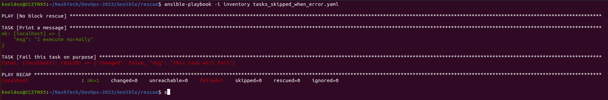
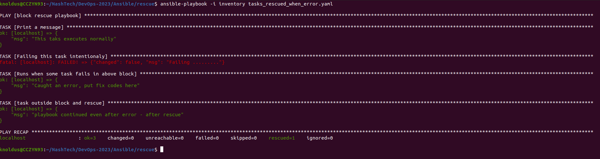

# Ansible rescue block

This template demonstrated exception handling in Ansible tasks. When one task fails, we can handle that error and allow ansible to continue running other task defined in the playbook instead of cancelling whole playbook. </br>

## Use Cases:
There could be plenty of scenarios for using this, but mentioning few ideas below, </br>
- Consider we have a task to start a service. 
    If service fails to start, rescue task will get logs from the service so we know why it failed without logging into the server or grep logs.
- Can also be used for cleanup purpose when some tasks fails.

## How to run:
``` ansible-playbook -i inventory tasks_skipped_when_error.yaml ```



In above image we can see, when `name: Fail this task on purpose` this tasks got into an error, the rest of the playbook didn't got executed. </br>

``` ansible-playbook -i inventory tasks_rescued_when_error.yaml ```



In above image we can see, when `name: Fail this task on purpose` this tasks got into an error, the rescue block is called and it printed output response. Later task outside the block `name: task outside block and rescue` also had normal execution. </br>


## Reference
- https://docs.ansible.com/ansible/latest/playbook_guide/playbooks_blocks.html

