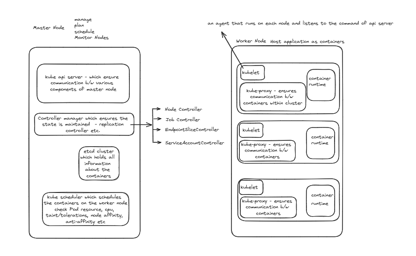

# Kubernetes Architechture:

- `K8s cluster` = Master node + worker node
- `Master node` = where control plane components run. 
    - The control plane manages the worker nodes and the Pods in the cluster.
    - In production environments, the control plane usually runs across multiple computers and a cluster usually runs multiple nodes, providing fault-tolerance and high availability.
- `Worker node` = set of nodes where application container runs.
    - The worker node(s) host the Pods that are the components of the application workload.  
# Understanding each components.
1. ETCD
# What is ETCD?
# What is key-value store?
# How to get work with ETCD?

2. Kube API Server
3. Kube Controller Manager
4. Kube Scheduler
5. Kubelet
6. Kube proxy

# Docker vs Containerd

