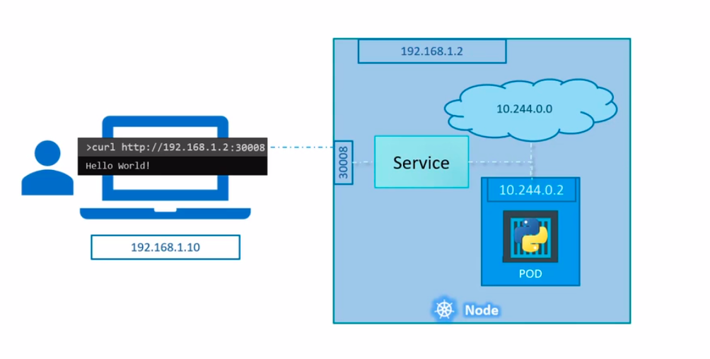
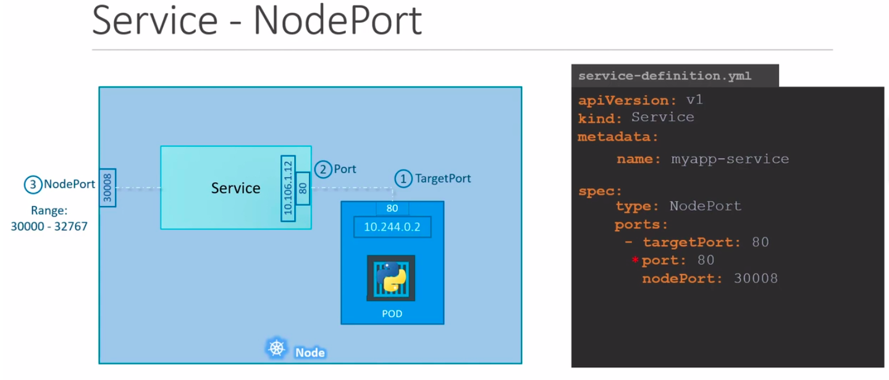
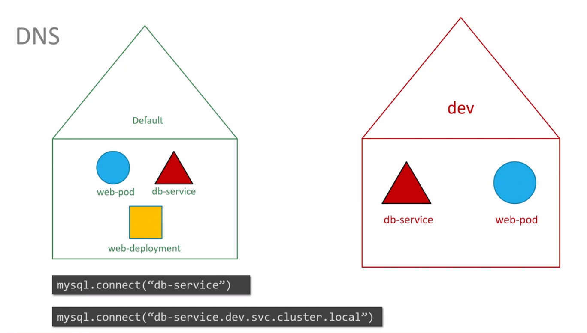
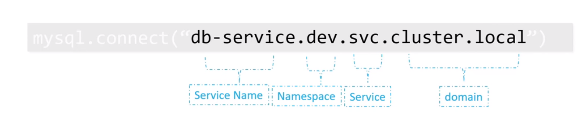

1. Pod (v1)
- A pod can have multiple container but with the fact that they shouldn't be of same kind.

- kubectl run nginx --image nginx
- kubectl get pods
- kubectl describe pod pod_name 

2. ReplicaSet
- Replication Controller - ReplicationController is old method which is replaced by ReplicaSets.
- Ensures HA
- Number of replicas/pods >= 1
- Load Balancing and Scaling
- rs monitors the pods and if nayone fails, it deploys new one.
    - How the rs know which set of Pods to monitor. Here comes the concept of labels and selectors.
        - Labels and Selectors:
                selector:
                    matchLabels:
                        tier: kodekloud
        
    - Scale
        `kubectl scale -replicas=6 -f rs.yaml`
    - edit resource
        `kubectl edit rs replica-set-name`
    
3. Deployments
- It is a high level k8s object.
- It is an wrapper around replicaSets.
- It creates a replicaset.

`kubectl apply -f deployment.yaml`
`kubectl get deploy`
`kubectl get rs`
`kubectl get po`
`kubectl get all`

kubectl copt file from a Pod to vm
kubectl cp podname:path_lo_log ./nameoflogs

## Create an NGINX Pod

`kubectl run nginx --image=nginx`

## Generate POD Manifest YAML file (-o yaml). Don’t create it(--dry-run)

`kubectl run nginx --image=nginx --dry-run=client -o yaml`

## Create a deployment

`kubectl create deployment --image=nginx nginx`

## Generate Deployment YAML file (-o yaml). Don’t create it(--dry-run)

`kubectl create deployment --image=nginx nginx --dry-run=client -o yaml`

## Generate Deployment YAML file (-o yaml). Don’t create it(--dry-run) and save it to a file.

`kubectl create deployment --image=nginx nginx --dry-run=client -o yaml > nginx-deployment.yaml`

## Make necessary changes to the file (for example, adding more replicas) and then create the deployment.

`kubectl create -f nginx-deployment.yaml`


## In k8s version 1.19+, we can specify the –replicas option to create a deployment with 4 replicas.

`kubectl create deployment --image=nginx nginx --replicas=4 --dry-run=client -o yaml > nginx-deployment.yaml`


4. Services
- a k8s object
- Its objective is to make external user access the application running inside the Pod within a Node without actually doing an exec to the Node.



Types:
    - NodePort
    - ClusterIP
    - LoadBalancer

4. 1. Node Port
    - range: 30000-32767
        

        `kubectl create -f service.yaml`
        `kubectl get svc`
        `curl http://<nodeIP>:<nodePort>`

4. 2. ClusterIP

4. 3. LoadBalancer


5. Namespaces
```
A namespace is an isolated space where we can run our workloads without getting affected by other irrelavant resources.
```
By default K8s creates several namespaces on it own,
    - kube-system
        - k8s creates several resources for its internal use, such as for dns resolution, networking sols.
    - default
    - kube-public
        - This is where resources made available to users are created. (**)

Communication between two resources created in different namaspaces,





6. Imperative vs Declarative
6. 1. Imperative
        Set of instructions to do a work one by one.
            - commands
        Good for debugging and testing things locally.
        Saves time and doesn't affect the actual manifest file.
        Hard to keep track of k8s resource.
    ```
    kubectl run --image=nginx nginx
    kubectl create deploy --image=nginx nginx
    kubectl expose deploy nginx --port 80
    kubectl edit deploy nginx
    kubectl scale deployment nginx --replicas=5
    kubectl set image deployment nginx nginx=nginx:1.18
    ```

6. 2. Declarative
        Declare each step minimally.
            - manifests
        Maintains single source of truth.
        Easy for maintaining state of K8s resource.
        Easy to keep tarck of K8s reosurces.

    ```
    kubectl apply -f nginx.yaml

    --dry-run=client : doesn't creates resources and tells if config and command in right.
    -o yaml   : output the resource as yaml

    kubectl create deployment nginx --image=nginx --dry-run=client -o yaml > nginx-deployment.yaml
    kubectl expose pod redis --port=6379 --name redis-service --dry-run=client -o yaml
    kubectl expose pod nginx --type=NodePort --port=80 --name=nginx-service --dry-run=client -o yaml
    kubectl create service nodeport nginx --tcp=80:80 --node-port=30080 --dry-run=client -o yaml
    ```


7. kubectl apply command.
There are three files which plays a crucial role when we run a kubectl command to create/update the K8s objects.
7. 1. Local file
    - In our local system, where we write k8s manifests.
7. 2. Last applied configuration
    - In json form, maintained by K8s, keeps track of last applied configuration.
7. 3. Live Object Configuration
    - In yaml form, maintained by K8s based on live status of the Objects.
