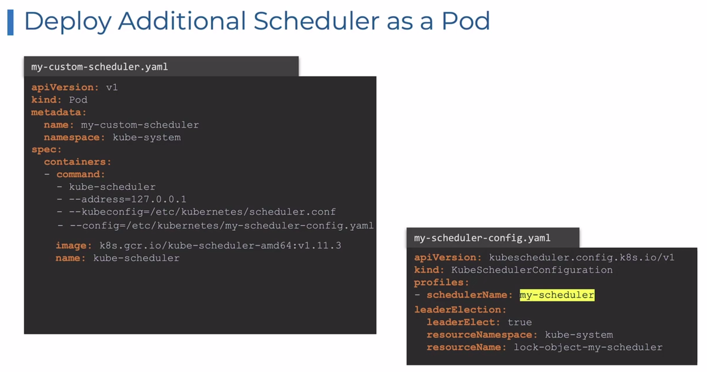

# Scheduling
Scheduling means assigning Pod to to Nodes. 
A scheduler watches for newly created Pods that have no Nodes assigned and it becomes responsible for finding best Node for that Pod to run on.

## 1. Manual Scheduling
```
apiVersion: v1
kind: Pod
metadata:
  name: panda-pod
  labels:
    app: panda
    type: kodekloud
spec:
  containers:
    - name: nginx-container
      image: nginx
  nodeName: <nodename>
```

### 2. Labels and Selectors
- group things together based on certain properties and criteria.
- group and select objects.

In k8s terms, 
there are number of resources available in k8s, Pods, deployments, replicaSets, statefulsets etc.
As our K8s environments increases we might have 100, 1000 of resources creates, multiple applications being hosted on K8s etc. We want to keep things organised and easy to find when it is needed.
This makes things easy to understand and very helpful in case of debugging.

K8s objects can be divided based on,
- type of object (POD/ReplicaSets,Deployments/Services ect)
- app type (app1/app2/app3/...)
- functionality (frontend/webservers/backend/audit/Database/ etc)

- Annotations:
record other details for informations. ex. buildVersion etc.

### 3. Taint and Tolerations

Taint - applied to Nodes
Tolerations - applied to Pods.

Taint and tolerations are used to set restrictions on Nodes that which Pod it can accept.

By default, k8s tries to divide the load equally to available nodes in the cluster.
Suppose a use case where you want to restrict a Node to have only certains Pod to be placed based on some set of rules.

kubectl taint nodes node-name key=value:taint-effect

taint-effect - What happens to the Pod that DO NOT TOLERATE this taint?
 - NoSchedule (Gauranteed that Pod will not schedule on the Node)
 - PreferNoSchedule (Not Gauranteed)
 - No Execute (will not execute the new Pods without toleration and existing Pods without tolerations will be EVICTED)

Scheduler doesn't place any Pod to master node. Why?
taint is set on Master Node.

### 4. Node Selector
Run a Pod on specific Node.
    - label the node in key value manner for e.g. size: Large.
    - then in pod defition refer that with nodeSelector.

Labelling a Node:
- `kubectl label nodes <nodename> <labelkey>=<labelvalue>`

Limitations:
- single label and selector possible. What if want to customize it say, place Pod on any Node except one?
- Doesn't have capability to set multiple nodeSelector.

NodeAffinity and NodeAntiAffinity serves this purpose.

4. 1. Node Affinity
Pods are hosted on particular Node.
advanced capability. Can have multiple rules set.

4. 2. Node Anti affinity
4. 3. Pod Affinity


#### Taint and Tolerations vs Node Affinity
Alone applying Taints to a Node and Tolerations to a Pod, it doesn't gaurantees that a Pod would be surely deployed to desired Node. K8s tries to do so, but it doesn't gaurantees.

Also, alone Node affinity doesn't gaurantees that no other Pods would be deployed to the Node. Athough it ensure that a Pod with affinity would be surely deployed to Node with matching labels, but other Pods can also be deployed on the same node.

To ensure that only specific Pod to be deployed to specific Node and not other Pod can be deployed on Node, we can have a combination of Taint and Tolerations and Node Affinity.

### Resource Limits
Objects:
- LimitRange
- ResourceQuota


### DaemonSets
- DaemonSets are like ReplicaSets, which allows to deploy multiple replicas of Pods.
- Difference is, it runs exactly one replica on each node in cluster.
- When a new nodes comes up, DaemonSet deploys a Pod on that node. 

* use cases of Daemon Set
- deploy a monitoring agent or log collector on each node of cluster.
- In k8s architechture, kube-proxy can be deployed as DaemonSet.

How does daemonset works?
- 

### Static Pods
- The Pods which are create by kubelet without intervention of Kube API Server are called Static Pod.
Use Case:
- Deploy control plane components as Static Pod.


# Multiple Scheduler
- we can have multiple scheduler - each must have different name
- Default scheduler is named - 'default scheduler' => configured in scheduler-config.yaml
- For creating a new scheduler, create a new file named '<scheduler_name>-config.yaml'
  ```
  apiVersion: kubescheduler.comfig.k8s.io/v1
  kind: KubeSchedulerConfiguration
  profiles:
  - schedulerName: <scheduler_name>
  ```
- simplest way to deploy addtional scheduler is, 
  Download kube scheduler binary and deploy as a service

- Deploy Scheduler as a Pod

  

- View Schedulers
  - kg po -n kube-system

- Use custome scheduler

  ```
  apiVersion: v1
  kind: Pod
  metadata:
    name: nginx
  spec:
    containers:
      - image: nginx
        name: nginx
    schedulerName: <custom-scheduler-name>
  ```

- View Events
  `kg events -o wide`

- view scheduler logs
  `k logs scheduler-name -n kube-system`


## Scheduler Profile
- How Pods are scheduled to a Node by Scheduler?
    - When `kubectl apply ... ` is perforrmed all Pod requests are put into or goes to `Scheduling Queue` and sorted based on Priority defined(using a PriorityClass Object) in Pod definition. 'PrioritySort' plugin used.
    - After Queue, it goes to filtering, means which nodes can't run the Pod (maybe based on node affinity rules, resource constraints etc.) 'NodeResourceFit', 'NodeName', 'NodeUnschedulable' (cordon command on node) plugin
    - Next step is Scoring, remaining Nodes are scored based on their capability of running the Pod (resource again), one with high score(highly capable - high resource available) is picked up for Pod. 'NodeResourceFit' , 'ImageLocality', plugin
    - Next step is Binding, Pod is bound to the node with high score. 'DefaultBinder' plugin

  - At each step, extenstion point is available, means from where we can chaneg the plugin to use or not to use.
    Type of extenstions:
      - queueSort
      - preFilter
      - filter
      - postFilter
      - preScore
      - score
      - reserve
      - permit
      - preBind
      - bind
      - postBind

     

# Reference:
https://github.com/kubernetes/community/blob/master/contributors/devel/sig-scheduling/scheduling_code_hierarchy_overview.md

https://kubernetes.io/blog/2017/03/advanced-scheduling-in-kubernetes/

https://jvns.ca/blog/2017/07/27/how-does-the-kubernetes-scheduler-work/

https://stackoverflow.com/questions/28857993/how-does-kubernetes-scheduler-work