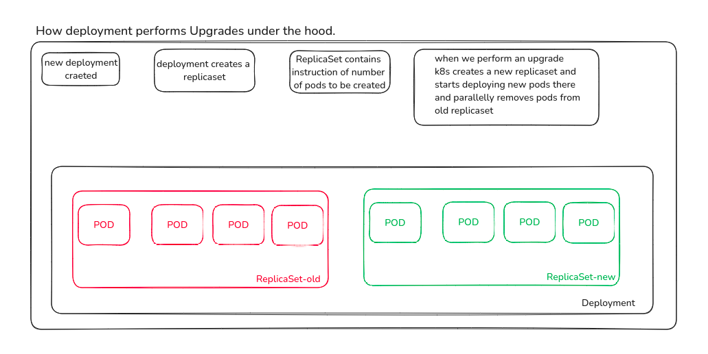

# Application Lifecycle Management
- Rolling Updated
- Rollbacks
- Configure Applications
- Scale Apps.
- Self Healing


## Updates and Rollbacks in Deployment.
0. Rollouts and versioning
When we create a new deployment, it triggers rollout, a new rollout creates a new "Deployment Revision" say revision: 1
In future, when a container version is updated, a new rollut is triggerred and it creates a new "Deployment revision" say revision: 2

This helps to track the rollout versions, move back to older version if needed.

Rollout Command:
`kubectl rollout status <deployment-name>`
`kubectl rollout history <deployment-name>`

1. Deployment Strategy
- Recreate
    - Shuts down all replicas and creates new.
    - Application Down for some time and not accessiblt to user.
- Rolling Update
    - Updates one by one.
    - No application downtime.
    - Default deployment strategy.

2. How Deployment performs Upgrades under the hood.


3. Rollback
`kubectl rollout undo <deployment-name>`

4. Command and Arguments in a Pod definition file
- containers are not meant to host an OS.
- They are meant to run a specific task.
- A container lives as long as the process within it runs.

CMD vs ENTRYPOINT

CMD
```
FROM Ubuntu
CMD sleep 10
```
-> docker run ubuntu-sleeper sleep 10

In CMD whole CMD is copied to run command.

ENTRYPOINT
```
FROM Ubuntu
ENTRYPOINT sleep
```
-> docker run ubuntu-sleeper 10

In ENTRYPOINT just the paramater passed is appended.

Problem:
`docker run ubuntu-sleeper` this will give error in case of entrypoint, since it expects operand.

Solution:
Use both, CMD and ENTRYPOINT
```
FROM Ubuntu
ENTRYPOINT ["sleep"]
CMD ["10"]
```

- How can we modify entrypoint command, suppose instead of sleep, something else say - sleep2.0
` docker run --entrypoint sleep2.0 ubuntu-sleeper 10`
