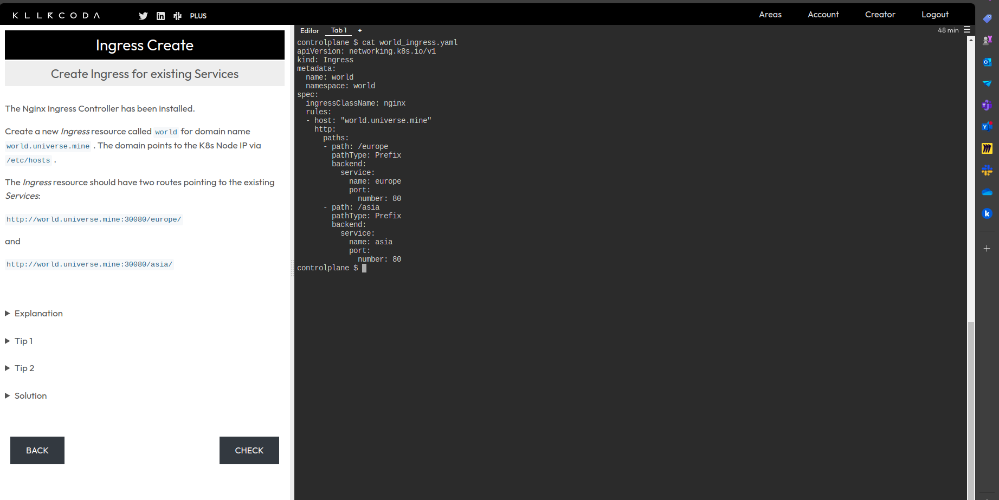
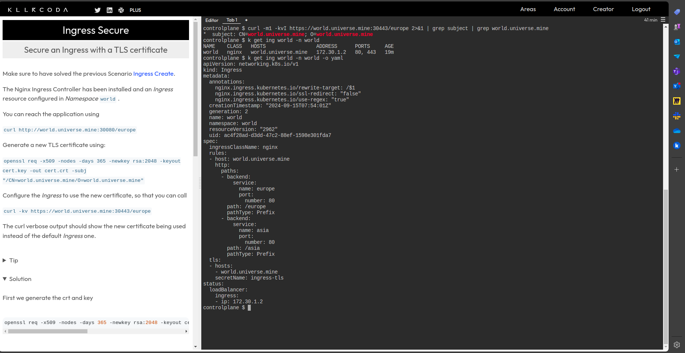

# Nginx Ingress Controller

The NGINX Ingress Controller is production‑grade Ingress controller (daemon) that runs alongside NGINX Open Source or NGINX Plus instances in a Kubernetes environment.

https://kubernetes.github.io/ingress-nginx

## Secure nginx with TLS

### Ingress Setup
- create a deploy
- expose application locally
- expose using nginx ingress
- secure nginx with TLS
