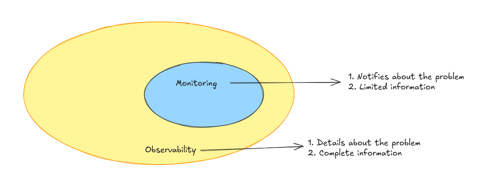
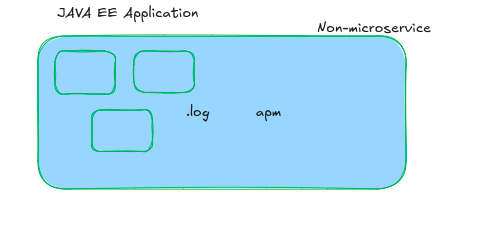
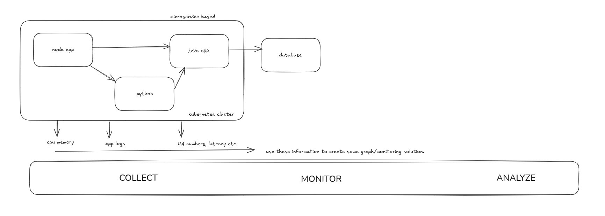
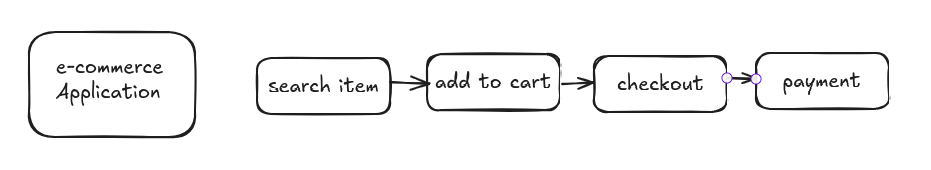

# Problem Statement:
Application is deployed to Kubernetes Cluster. Every application, is prone to issues and it might happen at anytime.
The problem is, who finds the issue first, is it customer or us?
If customer finds it, that's not a ideal scenario, it breaks customer's confidence in product.

If we find it and provide solution/fix, it builds confidence in product and service.

In order to find the issues quicky and effectively, we have Observability and Monitoring.

# Monitoring
Suppose you have an e-commerce web application, 

The user faces high latency when he tries to find the product, in that case he might start to find alternate e-com websites.

With Monitoring we can set some alert based on average time to get the product when user search it. Whenever the time is more than that, the alert will trigger a notification on slack/teams/mail etc to inform  and we might take necessary steps to resolve this.

- Prometheus and Grafana
    - helps to track health of individual component.
    - servers/database/networks/infrastructure etc.

# What to Monitor?
- Latency
    - Time to travel request from client to the server and get response back.
- Traffic
    - Number of request a system receives over a specific period.
- Errors
    - Percentage of request resulting in errors, such ad 404 or 500 errors. 
- Saturation
    - Measures resource utilization, CPU, memory, disk usage.

# Observability aka O11y
Observability helps us to provide details about the ongoing issues in the application with proper logs and metrics.
- 3 Pillars of Observability
    - Logs
        - Provides a chronological records of events or transactions within a system., When something happened and What happend.
            Tools:
            - ELK - ElasticSearch, Logstash
            - Grafana Loki
    - Metrics
        - Quantitative measurements that offer a snapshot of a system's performance ovet time.
            - Numerical values,
                - response time
                - error rate
                - resource utilzation.
            - Tools
                - Prometheus
                    - collects metrics from nodes, k8s services, node and provide querying and alerting mechanism.
    - Traces
        - Helps to track the flow of requests through various services and components of system.
        - Tools
            - Grafana Tempo
            - Zipkin

# What are cleanup logs?

# What to log?

# How to decide a monitoring solution?
1. Automation
    - when new service is added, the monitoring dashboard should automatically updates.
    - Right agent should be installed automatically when upgrading to new version.
2. Context
    - How other services communicate/related with each other.
    - latency charts
3. Action
    - Provides details, which are enough to take quick action.