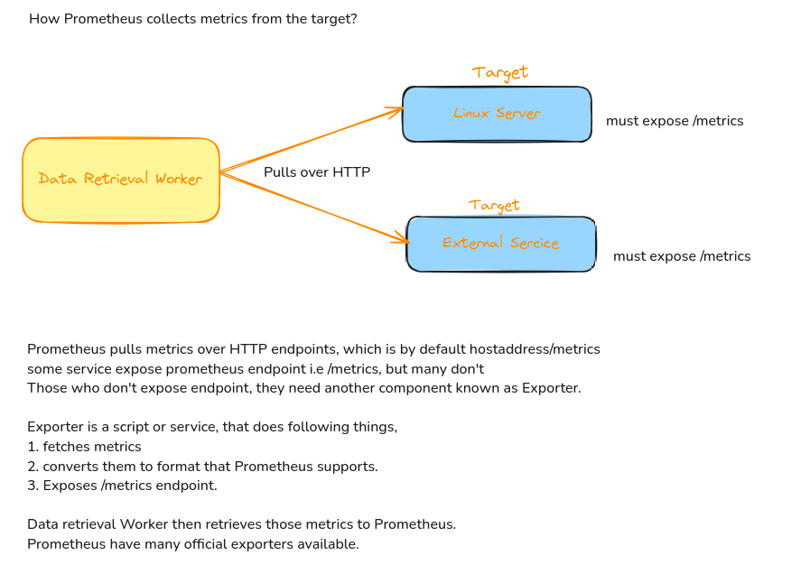

# Prometheus

## What?
- Monitoring tool.
- Monitor highly dynamic container environment such as k8s, docker swarm. Can also be used in Traditional bare metal infrastructure.
- Very famous in container and microservice infrastructure.

## Why and Where used?
- In modern day devops, where application is running in cloud infrastruture with plenty of servers running multiple containers which are interconnected with each other. We need to have insight of inner system, that what is happening inside and how the services are communicating with each other.
    - Key required informations are,
        - Response Latency
        - Overloaded?
        - Errors
        - Resources, cpu and memory
    - Constantly monitor all services
    - alert with crash
    - identify problem before.

- checking momory usage
- notify admin based on alert.
- Prometheus provide "Automated Monitoring" and "Alerting".

## Architecture


Time Series database
- Current CPU usage
- No. of exceptions

Data Retrieval Worker
- getting/pulling metrics from the applications, services, servers and other target resources and storing them to time series database.

Accepts PromQL queries
- Webserver
- display data to UI, it could be Prometheus dashboard or grafana.


## Targets and Metrics

### What does Prometheus Monitor?
Prometheus can retrieve information/metrics for many things, like
- Linux/Windows Server
- Standalone Apache Server
- Single Applications
- Services like Database


For all above, what Prometheus monitors is called Targets. Each target have units.
- Linux/Windows Server have these as Units, 
    - CPU status
    - Memoty/Disk Space Usage
    - Exceptions Count
- Standalone Apache Server
- Single Applications can have these units
    - Request Count, Request Duration.
- Services like Database


Unit we like to monitor for specific target is called metrics.
These metrics are saved to Prometheus time series database.

### Metrics
- Format: Human readable text based.
- Metrics entries: TYPE and HELP attributes.

> HELP: description of what the metrics is.
> TYPE: 3 metrics type
    - Counter
        - how many times x happened.
    - Gauge
        - what is the current value of x now?
    - Histogram
        - how long or how big the size of request was?


### How Prometheus Works?
- How it collects Metrics data from Targets?



## Example Scenario
- Monitor a Linux Server
    - download a node exporter
    - untar and execute
    - converts metrics of server
    - exposes /metrics endpoint.
    - configure prometheus to scrape this endpoint.


- How many requests?
- How many exceptions?
- How many server resources are used?

For these, there is Prometheus Client libraries for different language. Using these libraries, we can expose /metrics endpoint. </br>

#### NOTE:
- Exporters are also available as Docker Images.
- Suppose you want to monitor mysql container in K8s cluster, then deploy a  sidecar container of mysql exporter that will run inside pod with mysql service and connect to mysql service to get metrics and expose /metrics endpoint.

## How it is Used?


## Key Characterstics
## Pull Mechanism
Prometheus Pulls metrics from the Target Server using Data Retrieval Worker.

Many other Monitoring tools, like Amazon Cloud Watch, New Relic use Push system, which means applications/services are responsible for pushing their metric data to centralised collection platform of the monitoring tool.

When working with multiple microservice architechture, all trying to push data to centralised platform it puts high load of network traffic.
Also, monitoring becomes bottleneck sometimes due to flooding the network.
It needs additional software or tool on the server to push the metrics.


While Prometheus only needs a scraping endpoint.
Multiple Prometheus instances can pull metrics data.
By pulling mechanism, Prometheus can also identify if service is up and running.


- Prometheus is reliable
- standalone and self containing
- works even if other parts of infra is broken.
- no extensive setup needed.


- Prometheus is difficult to scale. Easy to use 1 node.
- Limits monitoring with 1 node.

- Workarounds?
    - increase Prometheus server capacity
    - limit number of metrics.

# Configuring Prometheus

- How does Prometheus know what to scrape and when?
    - prometheus.yml
        - define
            - which targets?
            - at what interval?
        Then Promethus uses service discovery mechanism to discover targets.

```
global:
    scrape_interval: 
    evaluation_interval:
rule_files:

scrape_configs:
    - job_name: prometheus
      static_configs:
        - targets: ['localhost:9090']
    - job_name: node_exporter
      scrape_interval: 1m
      scrape_timeout: 1m
      static_configs:
        - targets: ['localhost:9100']
```

## Alert Manager
Prometheus have a component named "Alert Manager", which is responsible for triggering alert based on the rule_files.
Prometheus Server pushes the alert to Alert manager and then Alert Manager notifies it to communication channels - Emails, Slack etc.


## Prometheus Data Storage
- Where does Promethus store data?
Time Series database. [Disk(HDD/SSD)]
It could be Local or Remote Storage system.


## PromQL Query Language
Once the metrics are store to database, using the Prometheus UI, we can query the data using PromQL language.
Also, Data Visualization tools can also be used to better present the metric data. Like Grafana, it also used PromQL under the hood to visualize the data.

## Prometheus with Docker and Kubernetes.
- fully compatible
- Prometheus components available as Docker images.
- can easily be deployed in Container Environment like kubernetes.
- Monitoring of K8s Cluster Node Resources out of the box. Means any new workload comes to K8s cluster, Prometheus starts pulling it metrics without extra configuration.

