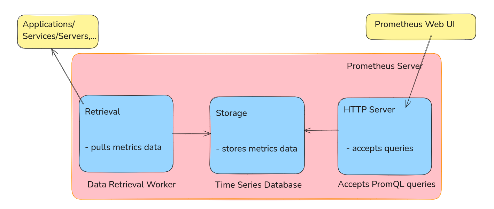

# Prometheus

## What?
- Monitoring tool.
- Monitor highly dynamic container environment such as k8s, docker swarm. Can also be used in Traditional bare metal infrastructure.
- Very famous in container and microservice infrastructure.

## Why and Where used?
- In modern day devops, where application is running in cloud infrastruture with plenty of servers running multiple containers which are interconnected with each other. We need to have insight of inner system, that what is happening inside and how the services are communicating with each other.
    - Key required informations are,
        - Response Latency
        - Overloaded?
        - Errors
        - Resources, cpu and memory
    - Constantly monitor all services
    - alert with crash
    - identify problem before.

- checking momory usage
- notify admin based on alert.
- Prometheus provide "Automated Monitoring" and "Alerting".

## Architecture

Time Series database
- Current CPU usage
- No. of exceptions

Data Retrieval Worker
- getting/pulling metrics from the applications, services, servers and other target resources and storing them to time series database.

Accepts PromQL queries
- Webserver
- display data to UI, it could be Prometheus dashboard or grafana.

## Targets and Metrics

### What does Prometheus Monitor?
Prometheus can retrieve information/metrics for many things, like
- Linux/Windows Server
- Standalone Apache Server
- Single Applications
- Services like Database

For all above, what Prometheus monitors is called Targets. Each target have units.
- Linux/Windows Server have these as Units, 
    - CPU status
    - Memoty/Disk Space Usage
    - Exceptions Count
- Standalone Apache Server
- Single Applications can have these units
    - Request Count, Request Duration.
- Services like Database

Unit we like to monitor for specific target is called metrics.
These metrics are saved to Prometheus time series database.

### Metrics
- Format: Human readable text based.
- Metrics entries: TYPE and HELP attributes.

> HELP: description of what the metrics is.
> TYPE: 3 metrics type
    - Counter
        - how many times x happened.
    - Gauge
        - what is the current value of x now?
    - Histogram
        - how long or how big the size of request was?

### How Prometheus Works?
- How it collects Metrics data from Targets?

## How it is Used?

## Key Characterstics

